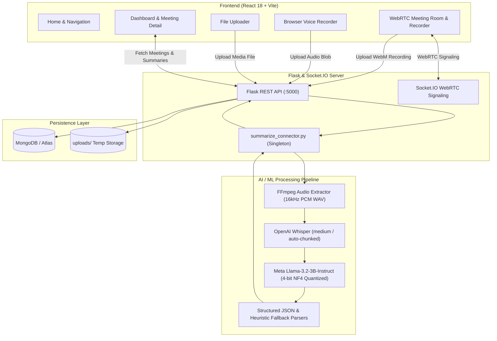

# 📝 TaskScribe — AI-Powered Meeting Intelligence & Summarization Platform

[](https://www.python.org/)
[](https://pytorch.org/)
[](https://huggingface.co/meta-llama/Llama-3.2-3B-Instruct)
[](https://github.com/openai/whisper)
[](https://react.dev/)
[](https://flask.palletsprojects.com/)
[](https://www.mongodb.com/)
[](https://webrtc.org/)
[](LICENSE)

**TaskScribe** is an end-to-end meeting intelligence platform that turns spoken conversations into structured, actionable business records. It supports **real-time WebRTC collaborative video meetings**, **in-browser microphone recording**, and **audio/video file uploads**, automatically transcribing audio via **OpenAI Whisper** and extracting **executive summaries**, **key decisions**, and **action items (with assignees & due dates)** using **Meta Llama-3.2-3B-Instruct** running locally with 4-bit quantization.

---

## 📑 Table of Contents

- [Overview](#-overview)
- [System Architecture](#-system-architecture)
- [Key Features](#-key-features)
- [AI/ML Pipeline Breakdown](#-aiml-pipeline-breakdown)
- [Tech Stack](#-tech-stack)
- [Repository Structure](#-repository-structure)
- [Prerequisites](#-prerequisites)
- [Installation & Setup](#-installation--setup)
  - [1. System Dependencies (FFmpeg)](#1-system-dependencies-ffmpeg)
  - [2. Backend Setup](#2-backend-setup)
  - [3. Frontend Setup](#3-frontend-setup)
- [Running the Application](#-running-the-application)
- [Standalone CLI Usage](#-standalone-cli-usage)
- [API & WebSocket Reference](#-api--websocket-reference)
- [Configuration](#-configuration)
- [Troubleshooting](#-troubleshooting)
- [License](#-license)

---

## 🌟 Overview

In modern workplaces, critical decisions and action items often get lost across hours of video calls and audio recordings. **TaskScribe** bridges this gap by automating the entire lifecycle of meeting records:

1. **Capture**: Host a live WebRTC multi-peer conference room, record voice directly in the browser, or upload past recordings (`.mp4`, `.mp3`, `.wav`, `.webm`, `.m4a`, etc.).
2. **Audio Normalization**: Automatic extraction and resampling to single-channel 16 kHz PCM audio via `ffmpeg`.
3. **Speech-to-Text**: High-accuracy transcription using OpenAI's Whisper model (with configurable chunking for multi-hour meetings).
4. **NLP Synthesis**: 3-stage prompting through Meta's `Llama-3.2-3B-Instruct` (quantized to 4-bit NF4 via BitsAndBytes) with JSON parsing and heuristic fallbacks to extract:
   - **Executive Summary** (synthesized context and key outcomes)
   - **Decisions Made** (binding team agreements)
   - **Action Items** (structured task, owner/assignee, due date, notes)
5. **Persistence & Export**: Stores records in MongoDB and allows instant review, dashboard search, and downloadable text reports.

---

## 🏗 System Architecture



---

## ✨ Key Features

- **🌐 Live WebRTC Multi-Party Rooms**: Create or join meeting rooms with unique room IDs. Includes real-time camera/microphone streaming and peer-to-peer WebRTC connections managed via Socket.IO signaling.
- **⏺️ In-Room Recording**: Record entire live video meetings client-side using `MediaRecorder`, automatically uploading the stream upon completion for instant processing.
- **🎙️ In-Browser Voice Recording**: Quick audio recording tab with a live timer for rapid memos or in-person huddles.
- **📁 Multi-Format Ingestion**: Supports `.mp4`, `.mp3`, `.wav`, `.webm`, `.m4a`, `.avi`, and `.mov` up to 500 MB.
- **🧠 Local AI Processing**: Runs completely offline or self-hosted without reliance on external paid API keys (OpenAI API not required; runs on local GPU/CPU).
- **⚡ 4-Bit Quantization (NF4)**: Utilizes BitsAndBytes 4-bit quantization on CUDA GPUs to run Llama-3.2-3B within ~3 GB of VRAM.
- **🛡️ Robust Extraction Fallbacks**: Features dual-stage parsing: strict JSON extraction with regex search, backed by rule-based heuristic text parsers to guarantee zero failures on non-standard LLM outputs.
- **📊 Comprehensive Dashboard**: Browse past meetings, filter action items, search discussions, and export formatted summary reports (`.txt`).

---

## 🔬 AI/ML Pipeline Breakdown

### 1. Audio Extraction (`complete_pipeline.step1_convert_video_to_audio`)
Normalizes any video or compressed audio stream to optimal Whisper input format:
```bash
ffmpeg -i input_file -vn -acodec pcm_s16le -ar 16000 -ac 1 -y output.wav
```

### 2. Automatic Speech Recognition (`step2_transcribe_audio`)
- Powered by `openai-whisper` (`medium` model default, configurable to `tiny`, `base`, `small`, or `large`).
- Built-in automatic chunking handles meetings exceeding 2+ hours without GPU out-of-memory errors.

### 3. Multi-Stage LLM Synthesis (`meeting_summarizer_v2.py`)
Rather than relying on one prone-to-hallucination prompt, TaskScribe runs a 3-stage chain:
1. **Stage 1 (Summary)**: Synthesizes core discussions and outcomes into a 4–6 sentence executive summary.
2. **Stage 2 (Decisions)**: Extracts all finalized team conclusions into a strict JSON list.
3. **Stage 3 (Action Items)**: Extracts actionable tasks with explicit fields:
   ```json
   [
     {
       "task": "Deploy updated backend service to staging",
       "owner": "Alice",
       "due_date": "Friday",
       "notes": "Pending integration test signoff"
     }
   ]
   ```

---

## 💻 Tech Stack

| Domain | Technology |
|---|---|
| **Frontend** | React 18, Vite, React Router v6, Axios, Socket.IO Client, Vanilla CSS |
| **Backend** | Python 3.8+, Flask 3.0, Flask-SocketIO, Flask-PyMongo, Werkzeug |
| **AI / NLP** | OpenAI Whisper, Hugging Face Transformers, Meta Llama-3.2-3B-Instruct, BitsAndBytes, PyTorch, Accelerate |
| **Media Processing** | FFmpeg (CLI), HTML5 MediaStream Recording API, WebRTC |
| **Database** | MongoDB (Local or MongoDB Atlas) |

---

## 📂 Repository Structure

```text
TaskScribe/
├── backend/
│   ├── .env                       # Backend environment variables
│   ├── .env.example               # Example configuration
│   ├── install_dependencies.bat   # Windows batch script for PyTorch + CUDA + NLP packages
│   ├── requirements.txt           # Python backend dependencies
│   ├── server.py                  # Flask REST API & WebRTC Socket.IO server
│   ├── start_backend.bat          # Script to launch backend virtual environment
│   └── summarize_connector.py     # Singleton bridge to ML summarizer pipeline
├── frontend/
│   ├── index.html                 # Single-page application root
│   ├── package.json               # Node.js dependencies & scripts
│   ├── vite.config.js             # Vite configuration
│   └── src/
│       ├── App.jsx                # Router & main application shell
│       ├── api.js                 # Axios API connector functions
│       ├── main.jsx               # React DOM entrypoint
│       └── pages/
│           ├── Home.jsx           # Landing page
│           ├── JoinMeeting.jsx    # Create/Join WebRTC live room
│           ├── MeetingRoom.jsx    # WebRTC live room with recording
│           ├── Record.jsx         # In-browser microphone recorder
│           ├── Upload.jsx         # Audio/video file upload interface
│           ├── Dashboard.jsx      # Meeting catalog & action item overview
│           └── MeetingDetail.jsx  # Detailed summary & download view
├── complete_pipeline.py           # CLI orchestrator: Video -> WAV -> Whisper -> LLM
├── config.py                      # Global parameters, prompt templates & model settings
├── meeting_summarizer_v2.py       # Core LLM engine (Llama-3.2, 4-bit NF4, fallback parsers)
└── README.md                      # Project documentation
```

---

## ⚙️ Prerequisites

1. **Python**: Version 3.8 to 3.11 recommended.
2. **Node.js**: Version 18.x or later with `npm`.
3. **FFmpeg**: Must be installed and accessible in your system `PATH`.
4. **MongoDB**: A running local instance (`mongodb://localhost:27017`) or a free [MongoDB Atlas](https://www.mongodb.com/atlas) cluster.
5. **NVIDIA GPU (Recommended)**: CUDA 11.8+ or 12.1+ with 6GB+ VRAM for fast Whisper and 4-bit Llama inference. (CPU mode is supported automatically as fallback).

---

## 🚀 Installation & Setup

### 1. System Dependencies (FFmpeg)

- **Windows (via Chocolatey or Scoop)**:
  ```powershell
  choco install ffmpeg
  # or
  scoop install ffmpeg
  ```
- **macOS (via Homebrew)**:
  ```bash
  brew install ffmpeg
  ```
- **Ubuntu/Debian**:
  ```bash
  sudo apt update && sudo apt install ffmpeg
  ```

Verify installation:
```bash
ffmpeg -version
```

---

### 2. Backend Setup

1. **Navigate to the backend directory and create a virtual environment**:
   ```bash
   cd backend
   python -m venv venv
   ```

2. **Activate the virtual environment**:
   - **Windows**:
     ```powershell
     venv\Scripts\activate
     ```
   - **macOS/Linux**:
     ```bash
     source venv/bin/activate
     ```

3. **Install Core & ML Dependencies**:
   ```bash
   pip install --upgrade pip
   pip install -r requirements.txt
   ```

   > 💡 **Windows Users with CUDA**: You can also run `install_dependencies.bat` to install the correct PyTorch CUDA builds and `bitsandbytes`.

4. **Hugging Face Authentication (For Llama 3.2)**:
   Meta's Llama-3.2 is a gated model. Request access on [Hugging Face](https://huggingface.co/meta-llama/Llama-3.2-3B-Instruct) and log in via CLI:
   ```bash
   pip install huggingface_hub
   huggingface-cli login
   ```

5. **Configure Environment Variables**:
   Create a `.env` file in the `backend/` directory:
   ```env
   MONGO_URI=mongodb://localhost:27017/meeting_summarizer
   # Or for MongoDB Atlas:
   # MONGO_URI=mongodb+srv://<username>:<password>@cluster0.mongodb.net/meeting_summarizer?retryWrites=true&w=majority
   FLASK_ENV=development
   ```

---

### 3. Frontend Setup

1. **Navigate to the frontend directory**:
   ```bash
   cd ../frontend
   ```

2. **Install npm dependencies**:
   ```bash
   npm install
   ```

3. **Configure Frontend Environment**:
   Create a `.env` file in the `frontend/` directory (optional, defaults to `http://localhost:5000`):
   ```env
   VITE_API_URL=http://localhost:5000
   ```

---

## 🏃 Running the Application

### 1. Start the Flask Backend Server
In your backend terminal (with `venv` activated):
```bash
cd backend
python server.py
```
*The server starts on `http://localhost:5000` with WebRTC Socket.IO signaling enabled.*

### 2. Start the Vite React Frontend
In a separate terminal:
```bash
cd frontend
npm run dev
```
*The frontend will run at `http://localhost:3000`.*

Open your browser and navigate to **`http://localhost:3000`** to start using TaskScribe!

---

## 🖥 Standalone CLI Usage

If you prefer processing meeting recordings directly from the terminal without launching the web server:

### Run the Complete Pipeline
Edit `config.py` to point `VIDEO_FILE` to your target file, or execute:
```bash
python complete_pipeline.py
```
This performs:
1. Video to 16 kHz Mono WAV audio extraction.
2. Whisper speech transcription (saved to `transcription.txt`).
3. Llama-3.2 summarization & action item extraction (saved to `meeting_summary.json` and `meeting_summary.txt`).

### Run Only the Summarizer on an Existing Transcript
```bash
python meeting_summarizer_v2.py
```

---

## 📡 API & WebSocket Reference

### REST API Endpoints

| Method | Endpoint | Description | Payload / Params |
|---|---|---|---|
| `GET` | `/api/health` | Service health status | None |
| `POST` | `/api/upload` | Upload audio/video & run AI pipeline | `multipart/form-data`: `file`, `title`, `userName` |
| `GET` | `/api/meetings` | Retrieve all meetings list | None |
| `GET` | `/api/meeting/<id>` | Retrieve specific meeting record | Path param `id` |
| `GET` | `/api/meeting/<id>/download` | Download summary text file | Path param `id` |
| `DELETE` | `/api/meeting/<id>` | Delete meeting & uploaded media | Path param `id` |
| `POST` | `/api/room/create` | Create a new WebRTC room | JSON: `{"hostName": "Alice", "title": "Sprint Sync"}` |
| `GET` | `/api/room/<room_id>` | Fetch room details & live participant count | Path param `room_id` |

### WebRTC Socket.IO Signaling Events

| Event Name | Direction | Description |
|---|---|---|
| `join-room` | Client ➔ Server | User joins meeting room with `roomId`, `userName`, and `userId` |
| `user-joined` | Server ➔ Client | Broadcasts to room members when a new peer arrives |
| `room-users` | Server ➔ Client | Sends list of existing room participants to the newcomer |
| `webrtc-offer` | Bidirectional | Exchanges SDP Offer with peer |
| `webrtc-answer` | Bidirectional | Exchanges SDP Answer with peer |
| `webrtc-ice-candidate` | Bidirectional | Exchanges ICE candidates for NAT traversal |
| `leave-room` | Client ➔ Server | Disconnects peer and notifies others |
| `start-recording` / `stop-recording` | Bidirectional | Coordinates room-wide meeting recording status |

---

## 🔧 Configuration (`config.py`)

Key parameters in `config.py` can be adjusted without changing any application code:

```python
# Model Selection
LLM_MODEL = "meta-llama/Llama-3.2-3B-Instruct"  # or meta-llama/Llama-3.2-1B-Instruct
WHISPER_MODEL = "medium"                        # tiny, base, small, medium, large

# Audio & Transcription
AUDIO_SAMPLE_RATE = 16000
TRANSCRIPTION_LANGUAGE = "en"
WHISPER_CHUNK_LENGTH_S = None                   # Auto-chunking for long audio

# Generation Hyperparameters
LLM_TEMPERATURE = 0.3                           # Focused factual extraction
LLM_MAX_TOKENS = 512
LLM_TOP_P = 0.9
```

---

## ❓ Troubleshooting

### 1. `CUDA out of memory` during summarization
- In `config.py`, change `WHISPER_MODEL = "small"` or `"base"`.
- Switch `LLM_MODEL` to `"meta-llama/Llama-3.2-1B-Instruct"`.
- Ensure 4-bit quantization is enabled (requires `bitsandbytes` on Linux/WSL or Windows with precompiled wheels).

### 2. `ffmpeg` not found
- Ensure FFmpeg is installed and `ffmpeg -version` works in your terminal.
- On Windows, restart your command prompt or IDE after adding FFmpeg to system environment variables.

### 3. Gated repo error: `403 Forbidden` for Llama-3.2
- You must request model access on the Hugging Face model page.
- Run `huggingface-cli login` in your terminal and enter your Hugging Face User Access Token (with Read permissions).

### 4. MongoDB connection issues
- If using local MongoDB, verify the service is running (`mongod` or Windows Services).
- If using MongoDB Atlas, check network access whitelist (allow current IP or `0.0.0.0/0`) and verify username/password in `backend/.env`.

---

## 📄 License

This project is licensed under the **MIT License** — see the [LICENSE](LICENSE) file for details.

---

<p align="center">
  Built with ❤️ for intelligent, productive teams.
</p>
